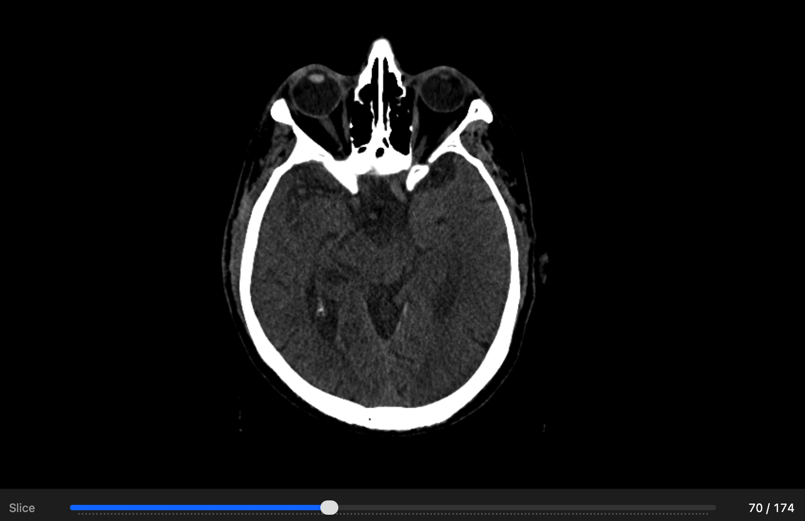

# Swift DICOM Decoder

<p align="center">
  
  
  
  
  <br/>
  
</p>



Pure Swift DICOM decoder toolkit for iOS and macOS. Parse DICOM metadata, extract pixel buffers, apply medical windowing, embed SwiftUI viewer components, and script inspection/export workflows with the bundled CLI.

Suitable for lightweight DICOM viewers, PACS clients, telemedicine apps, and research tools.

- Development repository: [`ThalesMMS/DICOM-Swift`](https://github.com/ThalesMMS/DICOM-Swift)
- Stable release line: [`ThalesMMS/DICOM-Swift` releases](https://github.com/ThalesMMS/DICOM-Swift/releases)
- Guides: [Getting Started](GETTING_STARTED.md) | [Usage Examples](USAGE_EXAMPLES.md) | [Glossary](DICOM_GLOSSARY.md) | [Troubleshooting](TROUBLESHOOTING.md)
- API docs: Generate locally with `swift package generate-documentation --target DicomCore`
- Related projects: [MTK](https://github.com/ThalesMMS/MTK) | [MTKDicomBridge](https://github.com/ThalesMMS/MTKDicomBridge) | [MTK-Demo](https://github.com/ThalesMMS/MTK-Demo)

## Table of Contents

- [Overview](#overview)
- [Features](#features)
- [Performance](#performance)
- [Release Status](#release-status)
- [Quick Start](#quick-start)
- [Installation](#installation)
- [Usage Examples](#usage-examples)
- [Command-Line Tool](#command-line-tool)
- [SwiftUI Components](#swiftui-components)
- [Architecture](#architecture)
- [Documentation](#documentation)
- [Integration](#integration)
- [Contributing](#contributing)
- [License](#license)
- [Support](#support)

---

## Overview

This project is a full DICOM decoder written in Swift, modernized from a legacy medical viewer. It provides:

- Complete DICOM file parsing (metadata and pixels)
- Pixel extraction for 8-bit, 16-bit grayscale, RGB, PALETTE COLOR, and YBR images
- Color display conversion matrix for MONOCHROME, RGB, PALETTE COLOR, YBR_FULL, YBR_FULL_422, and explicit unsupported YBR paths
- Image export API and CLI for PNG, JPEG, TIFF, 16-bit TIFF, multiframe output, and optional non-PHI metadata sidecars
- UI-independent print/export preprocessing pipeline for windowing, resize, and explicit annotation burn-in
- Export support matrix for image export, Secondary Capture, print management, waveform, and video helpers with typed unsupported-path diagnostics
- Window/level with medical presets and automatic suggestions
- Modern async/await APIs for non-blocking operations
- File validation before processing
- Directory, selected-file, and ZIP series loading through `DicomDecodedSeries`

DICOM (Digital Imaging and Communications in Medicine) is the standard for medical imaging used by CT, MRI, X-ray, ultrasound, and hospital PACS systems.

---

## Features

### DICOM Decoding

- Little/Big Endian, Explicit/Implicit VR
- Explicit-length and undefined-length SQ parsing, including nested items and strict delimiter diagnostics
- Grayscale 8/16-bit, RGB 24-bit, PALETTE COLOR, YBR_FULL/YBR_FULL_422, and ICC profile metadata
- Real World Value Mapping for linear/LUT quantitative maps with physical units and ranges
- Parametric Map Storage parsing for scalar layers with units, quantity definitions, RWV, geometry, and source references
- Structured Report and Key Object Selection parsing for navigable content trees, measurements, ROI references, CAD findings, and key image references
- Secondary Capture snapshot dataset building and parsing with patient/study/series context and source image references
- External inference builders for SR findings, SEG masks, GSPS graphic annotations, and derived images with source references and tracking identifiers
- Grayscale Softcopy Presentation State graphic annotation dataset building/parsing
- Encapsulated PDF, CDA, and STL document dataset building/parsing with MIME, title, concept, payload, and source instance metadata
- ECG and waveform dataset building/parsing with channel samples, sampling frequency, units, and waveform source references
- Video Endoscopic/Microscopic/Photographic dataset building/parsing with MPEG-2, H.264, and H.265 stream forwarding; native frame decode and transcoding fail with typed errors
- PET SUVbw/SUVlbm/SUVbsa/SUVibw helpers with required-metadata diagnostics
- Transfer syntax registry and conservative transcode planning with codec diagnostics
- Compressed pixel support matrix with `decoded`, `delegated`, `streamed-only`, `unsupported`, and `out-of-scope` statuses
- Color display conversion matrix with stable diagnostics for unsupported photometric interpretation, sample count, planar layout, bit depth, alpha/extra samples, and transfer syntax context
- Transfer syntax writing matrix for native datasets, Deflated datasets, referenced datasets, and encapsulated Pixel Data passthrough
- Encapsulated Pixel Data parsing for Basic Offset Table, Extended Offset Table, fragments, and frame extraction
- Deflated Explicit VR Little Endian dataset read/write support through zlib
- Native JPEG Lossless decoding (Process 14, all selection values 0-7) for transfer syntaxes 1.2.840.10008.1.2.4.57 and 1.2.840.10008.1.2.4.70
- Native RLE Lossless decoding and JPEG-LS lossless/near-lossless decoding when `DicomCodecRuntimePreflight` reports the CharLS runtime available
- Explicit JPEG Baseline, JPEG 2000, and diagnostic unsupported-path handling when the selected backend cannot preserve pixel precision
- JPEG 2000 Part 2 multi-component volume documents (1.2.840.10008.1.2.4.92 and .93) decoded through OpenJPEG into `DicomSeriesVolume` when `DicomCodecRuntimePreflight` reports OpenJPEG available
- JPIP referenced pixel data (1.2.840.10008.1.2.4.94 and deflated .95) with progressive volume update streams through caller-provided transport
- DICOMweb helpers with an explicit conformance matrix: QIDO-RS study search, WADO-RS metadata/instance retrieval, WADO-URI, STOW-RS multipart Part 10 storage, BulkDataURI retrieval through injected transport, optional bearer-token auth in the in-memory server, limit/offset pagination, and stable `501` errors for UPS and server-side frame/rendered-frame routes
- DIMSE helpers for tested C-ECHO, C-FIND, C-GET, C-MOVE, C-STORE, Storage SCP, Storage Commitment, MPPS, and Basic Grayscale Print workflows, with TLS/user-identity configuration, association pooling, retries, cancellation, circuit breaker, progress, and audit hooks
- Automatic memory mapping for large files (>10MB)
- Downsampling for fast thumbnail generation

### Geometry & Metadata

- Parses Image Orientation (Patient) (0020,0037) and Image Position (Patient) (0020,0032); exposes normalized row/column vectors and origin.
- Reads Pixel Spacing (0028,0030) and slice spacing/thickness; exposes spacingX/Y/Z.
- Exposes width/height, bitsAllocated, pixelRepresentation (signed/unsigned), rescale slope/intercept.
- Returns Series Description and raw tag access via `info(for:)`.

### Series Loading

- Directory-level loader that scans `.dcm` files, orders slices by IPP projection on the IOP normal (fallback: Instance Number), and computes Z spacing from IPP deltas.
- Validates single-channel 16-bit geometry consistency and assembles a contiguous volume buffer (signed/unsigned preserved).
- Progress callback per slice and lightweight `DicomSeriesVolume` with voxels, spacing, orientation matrix, origin, rescale parameters, and description.

### Image Processing

- Window/Level with medical presets (CT, mammography, PET, and more)
- Automatic preset suggestions based on modality and body part
- Quality metrics (SNR, contrast, dynamic range)
- Basic helpers for contrast stretching and noise reduction
- Hounsfield Unit conversions for CT images

### Modern APIs

- **Swift-idiomatic throwing initializers** for type-safe error handling
- **Type-safe DicomTag enum** for metadata access (preferred over raw hex values)
- **Type-safe value types** (WindowSettings, PixelSpacing, RescaleParameters) with Codable support
- **Quantitative pixel values** exposing stored, modality-transformed, and physical values for RWV maps and PET SUV workflows
- **V2 APIs** returning structs instead of tuples for better type safety
- **Async/await** support (iOS 13+, macOS 10.15+) with async throwing initializers
- **Static factory methods** for alternative initialization patterns
- **Validation** before loading
- **Convenience metadata helpers** (patient, study, series)
- **Tag caching** for frequent lookups

### Developer Experience

- Complete documentation with practical examples
- DICOM glossary
- Troubleshooting guide for common issues
- Tests covering parsing and series loading

---

## Performance

### Window/Level Processing Performance

The library uses **vDSP** (Accelerate framework) as the baseline CPU implementation for window/level operations. vDSP leverages hand-tuned **ARM NEON assembly** for SIMD operations, providing optimal CPU performance on Apple Silicon and Intel processors.

For applications requiring higher throughput, **Metal GPU acceleration** delivers significant performance gains over the vDSP baseline:

| Image Size | vDSP (CPU) | Metal (GPU) | Speedup |
|------------|------------|-------------|---------|
| 512×512    | 2.14 ms    | 1.16 ms     | 1.84×   |
| 1024×1024  | 8.67 ms    | 2.20 ms     | **3.94×** |

**Benchmark Environment:**
- Hardware: Apple M4 (2024)
- OS: macOS 15+
- Iterations: 100 (after 20 warmup iterations)
- Algorithm: Window/level transformation on 16-bit grayscale DICOM pixels

**Key Findings:**
- **vDSP baseline is optimal** - Uses ARM NEON assembly; further CPU SIMD optimizations yield negligible gains
- **Metal GPU shines on larger images** - 3.94× speedup on 1024×1024 images (typical CT/MRI size)
- **Small images favor CPU** - 512×512 images show 1.84× speedup due to GPU setup overhead
- **Production recommendation** - Use `.auto` mode for automatic backend selection, or choose `.metal`/`.vdsp` explicitly

**Usage:**

Metal GPU acceleration is integrated into `DCMWindowingProcessor.applyWindowLevel()` via the `processingMode` parameter:

```swift
// Default behavior (backward compatible) - uses vDSP
let pixels8bit = DCMWindowingProcessor.applyWindowLevel(
    pixels16: pixels16,
    center: 50.0,
    width: 400.0
)

// Explicit Metal GPU acceleration
let pixels8bit = DCMWindowingProcessor.applyWindowLevel(
    pixels16: pixels16,
    center: 50.0,
    width: 400.0,
    processingMode: .metal  // Force GPU (falls back to vDSP if unavailable)
)

// Automatic selection (recommended)
let pixels8bit = DCMWindowingProcessor.applyWindowLevel(
    pixels16: pixels16,
    center: 50.0,
    width: 400.0,
    processingMode: .auto  // Auto-selects Metal for ≥800×800 images
)
```

For more examples, see the windowing snippets in this README and the runnable code under `MetalBenchmark/`.

**Benchmark notes:** The benchmark harness used for these measurements lives in `MetalBenchmark/`, so the performance setup can be inspected and reproduced directly from this repository. Rerun benchmarks on the target hardware before making release or clinical-performance claims.

---

## Quick Start

### Fast Installation

Add to your `Package.swift`:

```swift
dependencies: [
    .package(url: "https://github.com/ThalesMMS/DICOM-Swift.git", from: "1.0.0")
]
```

### First Example (Modern API)

```swift
import DicomCore

do {
    // Load DICOM file with throwing initializer (recommended)
    let decoder = try DCMDecoder(contentsOfFile: "/path/to/image.dcm")

    print("Dimensions: \(decoder.width) x \(decoder.height)")

    // Recommended: Use type-safe DicomTag enum
    print("Modality: \(decoder.info(for: .modality))")
    print("Patient: \(decoder.info(for: .patientName))")

    // Legacy (deprecated): Raw hex values (still supported for custom/private tags)
    // print("Modality: \(decoder.info(for: 0x00080060))")

    if let pixels = decoder.getPixels16() {
        print("\(pixels.count) pixels loaded")
    }
} catch DICOMError.fileNotFound(let path) {
    print("File not found: \(path)")
} catch DICOMError.invalidDICOMFormat(let path, let reason) {
    print("Invalid DICOM file: \(reason)")
} catch {
    print("Error: \(error)")
}
```

**Alternative patterns:**

```swift
// Static factory method
let decoder = try DCMDecoder.load(fromFile: "/path/to/image.dcm")

// Async for non-blocking load
let decoder = try await DCMDecoder(contentsOfFile: "/path/to/image.dcm")

// URL-based initialization
let url = URL(fileURLWithPath: "/path/to/image.dcm")
let decoder = try DCMDecoder(contentsOf: url)
```

For a detailed walkthrough, see [GETTING_STARTED.md](GETTING_STARTED.md) and [USAGE_EXAMPLES.md](USAGE_EXAMPLES.md).

### Type-Safe Metadata Access

The library provides a **type-safe `DicomTag` enum** for accessing DICOM metadata, eliminating the need for raw hex values:

```swift
// Recommended: Type-safe and discoverable via autocomplete
let patientName = decoder.info(for: .patientName)
let modality = decoder.info(for: .modality)
let studyUID = decoder.info(for: .studyInstanceUID)
let rows = decoder.intValue(for: .rows) ?? 0
let windowCenter = decoder.doubleValue(for: .windowCenter)

// Legacy (deprecated): Raw hex values (still supported for custom/private tags)
let customTag = decoder.info(for: 0x00091001)  // Private tag
```

**Benefits:**
- **Type safety** - Compiler-checked tag names
- **Discoverability** - Autocomplete shows all available tags
- **Readability** - Semantic names instead of hex codes
- **Backward compatible** - Raw hex values still work for custom/private tags

See [Common DICOM Tags](#common-dicom-tags) for a full list of supported tags.

### Type-Safe Value Types (V2 APIs)

The library provides dedicated structs for common DICOM parameters, offering better type safety and Codable conformance than tuple-based APIs:

```swift
// Window settings as a struct (recommended)
let settings = decoder.windowSettingsV2  // WindowSettings struct
if settings.isValid {
    print("Window: center=\(settings.center), width=\(settings.width)")
}

// Pixel spacing as a struct (recommended)
let spacing = decoder.pixelSpacingV2  // PixelSpacing struct
if spacing.isValid {
    print("Spacing: \(spacing.x) × \(spacing.y) × \(spacing.z) mm")
}

// Rescale parameters as a struct (recommended)
let rescale = decoder.rescaleParametersV2  // RescaleParameters struct
if !rescale.isIdentity {
    let hounsfieldValue = rescale.apply(to: pixelValue)
}

// V2 windowing methods return WindowSettings
let optimal = DCMWindowingProcessor.calculateOptimalWindowLevelV2(pixels16: pixels)
let preset = DCMWindowingProcessor.getPresetValuesV2(preset: .lung)

// Legacy (deprecated): Tuple-based APIs (deprecated but still supported)
let (center, width) = decoder.windowSettings  // Returns tuple
```

**Benefits of V2 APIs:**
- **Type safety** - Structs prevent parameter order mistakes
- **Codable support** - Serialize to JSON for persistence
- **Sendable conformance** - Safe across concurrency boundaries
- **Computed properties** - `.isValid`, `.isIdentity` checks
- **Methods** - `.apply(to:)` for transformations
- **Better autocomplete** - Named properties instead of tuple labels

See [USAGE_EXAMPLES.md](USAGE_EXAMPLES.md#type-safe-value-types-v2-apis) for detailed migration examples.

---

## Installation

### Via Xcode

1. File -> Add Packages...
2. Paste `https://github.com/ThalesMMS/DICOM-Swift.git`
3. Select version `1.0.0` or later
4. Add Package

### Via Package.swift

```swift
// Package.swift
dependencies: [
    .package(url: "https://github.com/ThalesMMS/DICOM-Swift.git", from: "1.0.0")
],
targets: [
    .target(
        name: "MyApp",
        dependencies: [
            .product(name: "DicomCore", package: "DICOM-Swift")
        ]
    )
]
```

### Requirements

- Swift 5.9+
- iOS 13.0+ or macOS 12.0+
- Xcode 15.0+

---

## Usage Examples

### 1. Basic Reading

```swift
import DicomCore

do {
    // Recommended: Use throwing initializer
    let decoder = try DCMDecoder(contentsOfFile: "/path/to/ct_scan.dcm")

    // Use type-safe DicomTag enum for metadata access
    print("Patient: \(decoder.info(for: .patientName))")
    print("Modality: \(decoder.info(for: .modality))")
    print("Dimensions: \(decoder.width) x \(decoder.height)")

    if let pixels = decoder.getPixels16() {
        // Process image...
    }
} catch {
    print("Load error: \(error)")
}
```

### 2. Async/Await (iOS 13+)

```swift
func loadDICOM() async {
    do {
        let decoder = try await DCMDecoder(contentsOfFile: "/path/to/image.dcm")

        if let pixels = await decoder.getPixels16Async() {
            await showImage(pixels, decoder.width, decoder.height)
        }
    } catch {
        print("Error: \(error)")
    }
}
```

### 3. Window/Level with Medical Presets

```swift
guard let pixels = decoder.getPixels16() else { return }

// Use type-safe DicomTag enum
let modality = decoder.info(for: .modality)
let suggestions = DCMWindowingProcessor.suggestPresets(for: modality)

let lungPreset = DCMWindowingProcessor.getPresetValues(preset: .lung)
let lungImage = DCMWindowingProcessor.applyWindowLevel(
    pixels16: pixels,
    center: lungPreset.center,
    width: lungPreset.width
)

if let optimal = decoder.calculateOptimalWindow() {
    let optimizedImage = DCMWindowingProcessor.applyWindowLevel(
        pixels16: pixels,
        center: optimal.center,
        width: optimal.width
    )
}
```

### 4. Validate Before Loading

```swift
let tempDecoder = DCMDecoder()
let validation = tempDecoder.validateDICOMFile("/path/to/image.dcm")

if !validation.isValid {
    print("Invalid file:")
    for issue in validation.issues {
        print("  - \(issue)")
    }
    return
}

let decoder = try DCMDecoder(contentsOfFile: "/path/to/image.dcm")
```

### 5. Structured Metadata

```swift
let patient = decoder.getPatientInfo()
let study = decoder.getStudyInfo()
let series = decoder.getSeriesInfo()
```

### 6. Fast Thumbnail

```swift
if let thumb = decoder.getDownsampledPixels16(maxDimension: 150) {
    let thumbWindowed = DCMWindowingProcessor.applyWindowLevel(
        pixels16: thumb.pixels,
        center: 40.0,
        width: 80.0
    )
}
```

### 7. Quality Metrics

```swift
if let metrics = decoder.getQualityMetrics() {
    print("Image quality:")
    print("  Mean: \(metrics["mean"] ?? 0)")
    print("  Standard deviation: \(metrics["std_deviation"] ?? 0)")
    print("  SNR: \(metrics["snr"] ?? 0)")
    print("  Contrast: \(metrics["contrast"] ?? 0)")
    print("  Dynamic range: \(metrics["dynamic_range"] ?? 0) dB")
}
```

### 8. Hounsfield Units (CT)

```swift
let pixelValue: Double = 1024.0
let hu = decoder.applyRescale(to: pixelValue)

if hu < -500 {
    print("Likely air or lung")
} else if hu > 700 {
    print("Likely bone")
}
```

More examples: [USAGE_EXAMPLES.md](USAGE_EXAMPLES.md).

---

## Command-Line Tool

The `dicomtool` command-line utility provides fast DICOM file inspection, validation, and image export capabilities for developer workflows, scripting, and CI integration.

### Installation

**Homebrew formula:**

```bash
# From the repository checkout
brew install ./dicomtool.rb
```

**Build from source:**

```bash
git clone https://github.com/ThalesMMS/DICOM-Swift.git
cd DICOM-Swift
swift build -c release
cp .build/release/dicomtool /usr/local/bin/
```

### Quick Reference

```bash
# Inspect DICOM metadata
dicomtool inspect image.dcm

# Validate DICOM file conformance
dicomtool validate image.dcm

# Extract image with lung preset
dicomtool extract ct.dcm --output lung.png --preset lung

# Export every frame to predictable files
dicomtool extract perfusion.dcm --output ./frames --all-frames --metadata

# Batch process directory
dicomtool batch --pattern "*.dcm" --operation validate --format json
```

### Commands

#### `inspect` - Extract Metadata

Display DICOM metadata in human-readable or JSON format.

```bash
# Show common metadata tags
dicomtool inspect image.dcm

# Show all available tags
dicomtool inspect image.dcm --all

# Show specific tags
dicomtool inspect image.dcm --tags PatientName,Modality,StudyDate

# JSON output for scripting
dicomtool inspect image.dcm --format json
```

**Example output (text):**

```text
DICOM File: image.dcm
━━━━━━━━━━━━━━━━━━━━━━━━━━━━━━━━━━━━━━━━━━━━━━━━

Patient Information:
  Patient Name:     DOE^JOHN
  Patient ID:       12345
  Patient Birth:    1970-01-01

Study Information:
  Study Date:       2024-01-15
  Study Description: CT Chest with Contrast
  Modality:         CT

Image Properties:
  Dimensions:       512 × 512
  Bits Allocated:   16
  Pixel Spacing:    0.742 × 0.742 mm
```

#### `validate` - DICOM Conformance

Validate DICOM file structure and report issues.

```bash
# Validate single file
dicomtool validate image.dcm

# JSON output with detailed errors
dicomtool validate image.dcm --format json
```

**Example output:**

```text
✓ Valid DICOM file: image.dcm

Validation Results:
  • File size: 524,288 bytes
  • DICOM prefix: Present
  • Transfer syntax: 1.2.840.10008.1.2.1 (Explicit VR Little Endian)
  • Required tags: Complete
```

#### `extract` - Export Images

Extract pixel data with medical windowing presets or custom parameters. Supported output formats are PNG, JPEG, and TIFF; TIFF can preserve unsigned 16-bit stored samples when requested.

**Medical presets available:**
- `lung` - Lung tissue (-600/1500 HU)
- `bone` - Bone structures (400/1800 HU)
- `brain` - Brain tissue (40/80 HU)
- `softtissue` - Soft tissue (50/350 HU)
- `liver` - Liver imaging (80/150 HU)
- `mediastinum` - Mediastinum (50/350 HU)
- `abdomen` - Abdominal organs (60/400 HU)
- `spine` - Spine imaging (40/400 HU)
- `pelvis` - Pelvic structures (40/400 HU)
- `angiography` - Vascular imaging (300/600 HU)
- `pulmonaryembolism` - PE protocol (100/700 HU)
- `mammography` - Breast imaging (50/500 HU)
- `petscan` - PET imaging (0/5000)

```bash
# Extract with medical preset
dicomtool extract ct.dcm --output lung.png --preset lung

# Custom window/level
dicomtool extract ct.dcm --output custom.png \
  --window-center 50 --window-width 400

# Automatic optimal windowing
dicomtool extract ct.dcm --output auto.png

# JPEG export with explicit quality
dicomtool extract ct.dcm --output preview.jpg \
  --format jpeg --jpeg-quality 0.9

# TIFF export preserving unsigned 16-bit stored samples
dicomtool extract ct.dcm --output native.tiff \
  --format tiff --preserve-16-bit

# Export all frames with predictable names and non-PHI metadata sidecars
dicomtool extract perfusion.dcm --output ./frames \
  --all-frames --metadata

# Overwrite existing file
dicomtool extract ct.dcm --output result.png --overwrite
```

**Frame and metadata options:**
- `--frame <index>` exports one zero-based frame; default is frame 0.
- `--all-frames` treats `--output` as a directory and writes `base_frame0001.ext`, `base_frame0002.ext`, and so on.
- `--metadata` writes a JSON sidecar next to each image with non-PHI image attributes such as dimensions, frame number, modality, spacing, and display window.

#### `batch` - Batch Processing

Process multiple DICOM files using glob patterns with concurrent execution.

```bash
# Inspect all DICOM files in directory
dicomtool batch --pattern "*.dcm" --operation inspect

# Validate all files recursively with JSON output
dicomtool batch --pattern "**/*.dcm" --operation validate --format json

# Extract all files with lung preset to exports directory
dicomtool batch --pattern "studies/*/*.dcm" --operation extract \
  --output-dir ./exports --preset lung --image-format png

# Export all frames and sidecars during batch extraction
dicomtool batch --pattern "studies/*/*.dcm" --operation extract \
  --output-dir ./frames --all-frames --metadata --image-format jpeg

# Sequential processing (no concurrency)
dicomtool batch --pattern "*.dcm" --operation inspect --max-concurrent 1

# Custom windowing for batch extraction
dicomtool batch --pattern "*.dcm" --operation extract \
  --output-dir ./out --window-center 40 --window-width 80
```

**Glob pattern examples:**
- `*.dcm` - All .dcm files in current directory
- `**/*.dcm` - All .dcm files recursively
- `study_*/series_*/*.dcm` - Complex patterns with wildcards
- `{CT,MR}/*.dcm` - Multiple alternatives (brace expansion)

**Example output:**

```text
Processing 48 files with pattern: *.dcm
━━━━━━━━━━━━━━━━━━━━━━━━━━━━━━━━━━━━━━━━━━━━━━━━

Progress: [████████████████████] 48/48 (100%)

Summary:
  Total files:   48
  Successful:    46
  Failed:        2
  Duration:      3.2s

Failed files:
  • corrupt.dcm: Invalid DICOM format
  • partial.dcm: Unexpected EOF
```

### Use Cases

**Developer workflows:**

```bash
# Quick file inspection during debugging
dicomtool inspect mysterious_file.dcm

# Verify DICOM conformance before processing
if dicomtool validate input.dcm --format json | jq -e '.valid'; then
  echo "Processing valid DICOM file"
fi

# Generate preview images for web display
dicomtool batch --pattern "series/*.dcm" --operation extract \
  --output-dir ./previews --preset softtissue
```

**CI/CD integration:**

```bash
#!/bin/bash
# Validate DICOM test fixtures in CI pipeline

echo "Validating DICOM test files..."
if dicomtool batch --pattern "tests/fixtures/**/*.dcm" \
                    --operation validate \
                    --format json > validation.json; then
  echo "✓ All DICOM files valid"
  exit 0
else
  echo "✗ DICOM validation failed"
  cat validation.json | jq '.errors'
  exit 1
fi
```

**Batch conversion scripts:**

```bash
#!/bin/bash
# Convert hospital study archive to PNG previews

for study_dir in /mnt/pacs/studies/*; do
  study_id=$(basename "$study_dir")
  echo "Processing study: $study_id"

  dicomtool batch \
    --pattern "$study_dir/**/*.dcm" \
    --operation extract \
    --output-dir "./previews/$study_id" \
    --preset softtissue \
    --max-concurrent 8
done
```

**Research data validation:**

```bash
# Validate and report on research dataset
dicomtool batch --pattern "dataset/**/*.dcm" \
                --operation validate \
                --format json | \
  jq -r '.results[] | select(.valid == false) | .file' > invalid_files.txt

echo "Found $(wc -l < invalid_files.txt) invalid files"
```

### JSON Output Format

All commands support `--format json` for programmatic parsing:

```json
{
  "file": "image.dcm",
  "valid": true,
  "metadata": {
    "PatientName": "DOE^JOHN",
    "Modality": "CT",
    "StudyDate": "20240115",
    "Rows": "512",
    "Columns": "512"
  }
}
```

### Performance

- **Concurrent processing**: Default 4 concurrent operations (configurable with `--max-concurrent`)
- **Memory efficient**: Processes files individually, no bulk loading
- **Frame-addressable export**: Extract operations can write one frame or all frames without bulk series loading

### Requirements

- macOS 12.0+ (10.15+ for basic functionality)
- Swift 5.9+
- Xcode 15.0+ (for building from source)

---


## SwiftUI Components

The library includes **DicomSwiftUI**, a complete set of pre-built SwiftUI components for building DICOM medical image viewers with minimal code.
> Requires iOS 14+ / macOS 12+ (SwiftUI components use `@StateObject`).

### Available Components

| Component | Description | Key Features |
|-----------|-------------|--------------|
| **DicomImageView** | Display DICOM images | Automatic scaling, windowing modes, GPU acceleration |
| **WindowingControlView** | Interactive window/level controls | 13 medical presets, sliders, automatic optimization |
| **SeriesNavigatorView** | Navigate DICOM series | Slice navigation, progress indicator, thumbnail strip, keyboard shortcuts |
| **MetadataView** | Display DICOM metadata | Organized sections, formatted values, accessibility |

### Installation

Add DicomSwiftUI to your SwiftUI project:

```swift
// Package.swift
dependencies: [
    .package(url: "https://github.com/ThalesMMS/DICOM-Swift.git", from: "1.0.0")
],
targets: [
    .target(
        name: "MyApp",
        dependencies: [
            .product(name: "DicomSwiftUI", package: "DICOM-Swift")
        ]
    )
]
```

```swift
import SwiftUI
import DicomSwiftUI
```

### Quick Start Examples

#### 1. Basic DICOM Image Display

Display a DICOM image with automatic windowing:

```swift
import SwiftUI
import DicomSwiftUI

struct ContentView: View {
    let dicomURL: URL

    var body: some View {
        DicomImageView(url: dicomURL)
            .frame(maxWidth: .infinity, maxHeight: .infinity)
    }
}
```

**Features:**
- Automatic file loading
- Optimal window/level calculation
- Aspect ratio preservation
- Loading and error states

#### 2. Interactive Windowing Controls

Add medical preset buttons and interactive sliders:

```swift
struct DicomViewerView: View {
    let dicomURL: URL
    @StateObject private var imageViewModel = DicomImageViewModel()
    @StateObject private var windowingViewModel = WindowingViewModel()

    var body: some View {
        VStack {
            // Display image
            DicomImageView(url: dicomURL, viewModel: imageViewModel)

            // Windowing controls with presets
            if let decoder = imageViewModel.decoder {
                WindowingControlView(
                    decoder: decoder,
                    viewModel: windowingViewModel,
                    onWindowChange: { center, width in
                        imageViewModel.updateWindowing(.custom(center: center, width: width))
                    }
                )
            }
        }
    }
}
```

Compatibility note:
- The `DicomViewerView` example above uses `@StateObject` with `DicomImageViewModel` and `WindowingViewModel`, which requires iOS 14+.
- For iOS 13 targets, use `@ObservedObject` and initialize/inject the view models in `init`:

```swift
struct DicomViewerView: View {
    let dicomURL: URL
    @ObservedObject private var imageViewModel: DicomImageViewModel
    @ObservedObject private var windowingViewModel: WindowingViewModel

    init(
        dicomURL: URL,
        imageViewModel: DicomImageViewModel = DicomImageViewModel(),
        windowingViewModel: WindowingViewModel = WindowingViewModel()
    ) {
        self.dicomURL = dicomURL
        self.imageViewModel = imageViewModel
        self.windowingViewModel = windowingViewModel
    }

    var body: some View {
        // Same body as the @StateObject example
        DicomImageView(url: dicomURL, viewModel: imageViewModel)
    }
}
```

**Available presets:**
- **CT**: Lung, Bone, Brain, Liver, Mediastinum, Abdomen, Spine, Pelvis
- **Specialized**: Angiography, Pulmonary Embolism, Mammography, PET Scan

#### 3. Series Navigation

Navigate through multi-slice DICOM series:

```swift
struct SeriesViewerView: View {
    let seriesURLs: [URL]
    @State private var currentIndex = 0

    var body: some View {
        VStack(spacing: 0) {
            // Display current slice
            DicomImageView(url: seriesURLs[currentIndex])
                .frame(maxWidth: .infinity, maxHeight: .infinity)

            Divider()

            // Navigation controls
            SeriesNavigatorView(
                currentIndex: $currentIndex,
                totalCount: seriesURLs.count,
                onNavigate: { newIndex in
                    // Optional: Preload adjacent slices
                    preloadSlice(at: newIndex)
                }
            )
            .frame(height: 80)
        }
    }

    func preloadSlice(at index: Int) {
        // Preload logic here
    }
}
```

**Features:**
- First/Previous/Next/Last buttons
- Interactive slider
- Slice counter with progress percentage
- Keyboard shortcuts support

#### 4. Metadata Display

Show formatted DICOM metadata:

```swift
struct MetadataDisplayView: View {
    let dicomURL: URL

    var body: some View {
        VStack(spacing: 0) {
            DicomImageView(url: dicomURL)
                .frame(maxHeight: 400)

            Divider()

            MetadataView(url: dicomURL)
                .frame(maxHeight: 250)
        }
    }
}
```

**Displayed information:**
- **Patient**: Name, ID, Age, Sex, Birth Date
- **Study**: Date, Time, Description, Modality, Study UID
- **Series**: Number, Description, Series UID
- **Image**: Dimensions, Spacing, Position, Window/Level settings

#### 5. Complete DICOM Viewer

Combine all components into a full-featured viewer:

```swift
struct CompleteDicomViewerView: View {
    let seriesURLs: [URL]
    @State private var currentIndex = 0
    @StateObject private var imageViewModel = DicomImageViewModel()
    @StateObject private var windowingViewModel = WindowingViewModel()

    var body: some View {
        VStack(spacing: 0) {
            // Main image display
            DicomImageView(
                url: seriesURLs[currentIndex],
                viewModel: imageViewModel,
                windowingMode: .custom(
                    center: windowingViewModel.center,
                    width: windowingViewModel.width
                )
            )
            .frame(maxWidth: .infinity, maxHeight: .infinity)

            Divider()

            // Metadata panel
            MetadataView(url: seriesURLs[currentIndex])
                .frame(height: 150)

            Divider()

            // Windowing controls
            if let decoder = imageViewModel.decoder {
                WindowingControlView(
                    decoder: decoder,
                    viewModel: windowingViewModel,
                    layout: .compact,
                    onWindowChange: { center, width in
                        imageViewModel.updateWindowing(.custom(center: center, width: width))
                    }
                )
                .padding()
            }

            Divider()

            // Series navigation
            SeriesNavigatorView(
                currentIndex: $currentIndex,
                totalCount: seriesURLs.count
            )
            .frame(height: 80)
        }
    }
}
```

### Windowing Modes

DicomImageView supports multiple windowing strategies:

```swift
// Automatic optimal window calculation
DicomImageView(url: dicomURL, windowingMode: .automatic)

// Medical preset (13 presets available)
DicomImageView(url: dicomURL, windowingMode: .preset(.lung))
DicomImageView(url: dicomURL, windowingMode: .preset(.bone))
DicomImageView(url: dicomURL, windowingMode: .preset(.brain))

// Custom window/level values
DicomImageView(url: dicomURL, windowingMode: .custom(center: 50.0, width: 400.0))

// Use window/level from DICOM file tags
DicomImageView(url: dicomURL, windowingMode: .fromDecoder)
```

### GPU Acceleration

Enable GPU acceleration for large images:

```swift
// Automatic selection (recommended)
DicomImageView(
    url: dicomURL,
    processingMode: .auto  // Uses Metal for ≥800×800 images
)

// Force GPU processing
DicomImageView(
    url: dicomURL,
    processingMode: .metal  // Always use Metal (falls back to vDSP if unavailable)
)

// Force CPU processing
DicomImageView(
    url: dicomURL,
    processingMode: .vdsp  // Always use vDSP (Accelerate framework)
)
```

**Performance benefits:**
- 3.94× speedup for 1024×1024 images on Apple Silicon
- Automatic fallback to vDSP if Metal unavailable
- See [Performance](#performance) section for benchmarks

### Customization

All components support customization:

```swift
// Custom styling
DicomImageView(url: dicomURL)
    .background(Color.black)
    .cornerRadius(8)
    .shadow(radius: 4)

// Compact layout
WindowingControlView(decoder: decoder, layout: .compact)

// Expanded layout with more controls
WindowingControlView(decoder: decoder, layout: .expanded)

// Custom error handling
DicomImageView(url: dicomURL)
    .overlay {
        if let error = viewModel.error {
            ErrorView(error: error)
        }
    }
```

### Accessibility & Dark Mode

All components include comprehensive accessibility support:

- VoiceOver labels and hints
- Dynamic Type text scaling
- Keyboard navigation support
- Dark mode adaptive colors
- High contrast compatibility
- Reduced motion preferences

### Example Application

A complete reference implementation is available in `Examples/DicomSwiftUIExample/`:

```bash
# Run the example app
swift run DicomSwiftUIExample
```

**Demonstrates:**
- All four SwiftUI components
- Multiple windowing modes (automatic, presets, custom, GPU)
- Series loading and navigation
- Metadata display with different layouts
- Dark mode and accessibility features

See [Examples/DicomSwiftUIExample/README.md](Examples/DicomSwiftUIExample/README.md) for detailed usage.

### Documentation

- **Getting Started**: `Sources/DicomSwiftUI/DicomSwiftUI.docc/GettingStarted.md`
- **API Reference**: Run `swift package generate-documentation --target DicomSwiftUI`
- **Code Samples**: `Sources/DicomSwiftUI/DicomSwiftUI.docc/Resources/code-samples/`
- **Example App**: `Examples/DicomSwiftUIExample/`

### Platform Support

- **Core vs SwiftUI**: `DicomCore` supports iOS 13.0+ / macOS 12.0+; `DicomSwiftUI` components require iOS 14.0+ because examples use `@StateObject`.
- **Recommended**: Use the `@StateObject` examples on iOS 14+ / macOS 12+.
- **Legacy fallback (iOS 13)**: Use the `@ObservedObject` initialization/injection pattern shown above, then migrate to `@StateObject` when iOS 14+ is your minimum target.

---

## Architecture

### Main Components

| Component | Description | Primary Use |
|-----------|-------------|-------------|
| `DCMDecoder` | Core DICOM decoder | Load files, extract pixels and metadata |
| `DCMWindowingProcessor` | Image processing | Window/level, presets, quality metrics |
| `StudyDataService` | Data service | Scan directories, group studies |
| `DICOMError` | Error system | Typed error handling |
| `DCMDictionary` | Tag dictionary | Map numeric tags to names |

### Workflow

```
1. DICOM file
        |
2. validateDICOMFile() (optional)
        |
3. try DCMDecoder(contentsOfFile:) or try await DCMDecoder(contentsOfFile:)
        |
4. Decoder parses:
   - Header (128 bytes + "DICM")
   - Meta Information
   - Dataset (tags + values)
   - Pixel Data (lazy loading)
        |
5. Access data:
   - info(for: .modality) -> Metadata
   - getPixels16() -> Pixel buffer
   - applyWindowLevel() -> Processed pixels
```

### Project Structure

```
DICOM-Swift/
|-- Package.swift
|-- Sources/DicomCore/
|   |-- DCMDecoder.swift          # Core DICOM parser
|   |-- DCMDecoder+Async.swift    # Async/await extensions
|   |-- DCMWindowingProcessor.swift # Window/level processing
|   |-- MetalWindowingProcessor.swift # GPU-accelerated windowing
|   |-- DCMPixelReader.swift      # Pixel data extraction
|   |-- DCMTagParser.swift        # Tag parsing logic
|   |-- DCMBinaryReader.swift     # Binary data reader
|   |-- DCMDictionary.swift       # Tag name/number mapping
|   |-- DICOMError.swift          # Typed error definitions
|   |-- DicomConstants.swift      # DicomTag enum and constants
|   |-- DicomSeriesLoader.swift   # Series/volume loading
|   |-- DicomRLELosslessDecoder.swift # Native RLE Lossless decoder
|   |-- DicomJPEGLSCodec.swift    # JPEG-LS runtime bridge
|   |-- DicomDeflatedDataSetCodec.swift # zlib dataset deflate/inflate helper
|   |-- JPEGLosslessDecoder.swift # Native JPEG Lossless decoder
|   |-- PatientModel.swift        # Data model structures
|   |-- StudyDataService.swift    # Study/series grouping
|   |-- ValueTypes.swift          # V2 type-safe value types
|   |-- Protocols/                # Protocol abstractions
|   |-- TagHandlers/              # Per-VR tag handling
|   |-- Logging/                  # Logging utilities
|   |-- DicomCore.docc/           # DocC documentation
|   `-- Resources/DCMDictionary.plist
`-- Tests/DicomCoreTests/
```

### Common DICOM Tags

Use the type-safe `DicomTag` enum for accessing standard DICOM tags:

**Patient Information:**
```swift
.patientName                 // (0010,0010) - Patient Name
.patientID                   // (0010,0020) - Patient ID
.patientBirthDate            // (0010,0030) - Patient Birth Date
.patientSex                  // (0010,0040) - Patient Sex
.patientAge                  // (0010,1010) - Patient Age
```

**Study/Series Information:**
```swift
.studyInstanceUID            // (0020,000D) - Study Instance UID
.seriesInstanceUID           // (0020,000E) - Series Instance UID
.modality                    // (0008,0060) - Modality (CT, MR, XR, etc.)
.studyDescription            // (0008,1030) - Study Description
.seriesDescription           // (0008,103E) - Series Description
```

**Image Properties:**
```swift
.rows                        // (0028,0010) - Rows (height)
.columns                     // (0028,0011) - Columns (width)
.bitsAllocated               // (0028,0100) - Bits Allocated
.bitsStored                  // (0028,0101) - Bits Stored
.pixelRepresentation         // (0028,0103) - Pixel Representation
```

**Spatial Information:**
```swift
.imagePositionPatient        // (0020,0032) - Image Position (Patient)
.imageOrientationPatient     // (0020,0037) - Image Orientation (Patient)
.pixelSpacing                // (0028,0030) - Pixel Spacing
.sliceThickness              // (0018,0050) - Slice Thickness
```

**Window/Level:**
```swift
.windowCenter                // (0028,1050) - Window Center
.windowWidth                 // (0028,1051) - Window Width
.rescaleSlope                // (0028,1053) - Rescale Slope
.rescaleIntercept            // (0028,1052) - Rescale Intercept
```

For custom or private tags not in the enum, use raw hex values:
```swift
let privateTag = decoder.info(for: 0x00091001)  // Private manufacturer tag
```

---

## Documentation

### API Reference

This repository includes DocC documentation sources for `DicomCore` and `DicomSwiftUI`.

Generate the API reference locally with:

```bash
swift package generate-documentation --target DicomCore
swift package generate-documentation --target DicomSwiftUI
```

The API reference includes:
- Detailed class and method documentation
- Code examples and usage patterns
- Type definitions and protocols
- Complete symbol index

### Beginner Guides

| Document | Description | Best For |
|----------|-------------|----------|
| [Getting Started](GETTING_STARTED.md) | End-to-end tutorial | New to DICOM |
| [DICOM Glossary](DICOM_GLOSSARY.md) | Terminology reference | Understanding terms |
| [Troubleshooting](TROUBLESHOOTING.md) | Common issues and fixes | Debugging problems |

### Advanced Guides

| Document | Description | Best For |
|----------|-------------|----------|
| [Usage Examples](USAGE_EXAMPLES.md) | Complete, ready-to-use code samples | Copy and adapt |
| [CHANGELOG](CHANGELOG.md) | Release history | Tracking changes |

### Key Concepts

#### Window/Level

Controls brightness and contrast of DICOM images:
- Level (Center): brightness
- Width: contrast

```swift
// Lung: Center -600 HU, Width 1500 HU
// Bone: Center  400 HU, Width 1800 HU
// Brain: Center  40 HU, Width   80 HU
```

#### DICOM Tags

The library provides a type-safe `DicomTag` enum for accessing metadata:

```swift
// Recommended: Type-safe DicomTag enum
decoder.info(for: .patientName)       // Patient Name
decoder.info(for: .modality)          // Modality (CT, MR, etc.)
decoder.info(for: .rows)              // Image height
decoder.intValue(for: .columns)       // Image width (as Int)
decoder.doubleValue(for: .windowCenter)  // Window center (as Double)

// Legacy (deprecated): Raw hex values (still supported for custom/private tags)
decoder.info(for: 0x00100010)  // Patient Name
decoder.info(for: 0x00080060)  // Modality
decoder.info(for: 0x00280010)  // Rows
```

#### Hounsfield Units (CT)

Density scale in CT imaging:
- Air: -1000 HU
- Lung: -500 HU
- Water: 0 HU
- Muscle: +40 HU
- Bone: +700 to +3000 HU

---

## Integration

### Integration Tips

- Use background processing for large files:
```swift
Task.detached {
    let decoder = try await DCMDecoder(contentsOfFile: path)
}
```

- Validate before loading to improve UX:
```swift
let validation = decoder.validateDICOMFile(path)
if !validation.isValid {
    showError(validation.issues)
}
```

- Use thumbnails for image lists:
```swift
let thumb = decoder.getDownsampledPixels16(maxDimension: 150)
```

- Cache decoder instances per study:
```swift
var decoders: [String: DCMDecoder] = [:]
decoders[studyUID] = decoder
```

- Release memory during batch processing:
```swift
autoreleasepool {
    // Process file
}
```

### Known Limitations

- Compressed and referenced transfer syntaxes: inspect `DicomTransferSyntaxRegistry.standard.compressedPixelSupportMatrix` for the explicit status of every compressed pixel syntax. JPEG Lossless, RLE, and JPEG Extended 12-bit grayscale are `decoded` natively. JPEG Baseline, JPEG Extended <=8-bit, JPEG-LS, JPEG 2000, and JPEG 2000 Part 2 are `delegated` to ImageIO, CharLS, OpenJPEG, or `DicomJP3DVolumeDocument` with documented limits. JPIP and video syntaxes are `streamed-only`: encoded or referenced pixel data is exposed, but native frame decode is not performed. HTJ2K is `delegated` to the preflighted OpenJPEG runtime only when it includes the HT block decoder (version 2.5+; never the ImageIO fallback), and Deflated Explicit VR Little Endian is `out-of-scope` for pixel codecs because zlib handles dataset-level compression.
- Color display conversion: inspect `DicomColorDisplayConversionMatrix.standard` separately from compressed pixel support. `displayRGBPixelBuffer(frame:)` converts supported MONOCHROME1, MONOCHROME2, RGB, PALETTE COLOR, YBR_FULL, and YBR_FULL_422 native frames to interleaved RGB8 display data. Unsupported YBR variants, alpha/extra samples, unsupported planar layouts, and unsupported bit depths throw `DicomColorConversionError.unsupportedColorPath` with photometric interpretation, samples per pixel, planar configuration, bits allocated, and transfer syntax context.
- Dataset and file writing: inspect `DicomTransferSyntaxRegistry.standard.writeSupportMatrix` before writing. `DicomDataSetWriter` writes native and Deflated datasets, writes referenced JPIP metadata only when Pixel Data Provider URL is present, and preserves already encapsulated Pixel Data for compressed/video syntaxes. It does not recompress native pixels or decompress encapsulated payloads during reserialization; those attempts return stable `DicomDataSetWriterError` values before Part 10 output is generated.
- DICOMweb scope: inspect `DicomWebConformanceMatrix.packageDefault` before treating the package helpers as a production integration surface. `DicomWebClient` serializes tested QIDO-RS, WADO-RS, WADO-URI, STOW-RS, frame, rendered-frame, and BulkDataURI requests through the configured transport. `DicomWebServer` is an in-memory test/demo server for QIDO study search, WADO metadata/instance, WADO-URI, and STOW Part 10 payloads; UPS, server-side frame retrieval, server-side rendered frames, JPIP proxying, authorization policy, audit logging, persistent storage, and zero-copy large-payload streaming remain caller-owned or unsupported.
- DIMSE scope: `DicomDIMSEServiceSCU`, `DicomStorageSCPService`, and `DicomStorageSCPServer` cover package-tested SCU/SCP helper workflows. They are not a managed PACS service; archive qualification, operational authorization, PHI audit policy, deployment monitoring, and external endpoint validation remain caller-owned.
- Thread safety: `DCMDecoder` uses internal locking for public API access, and batch/series services create isolated decoder instances for concurrent work.
- Waveform scope: ECG and related waveform objects expose temporal samples and metadata; they are not converted into image-volume slices by `DicomSeriesLoader`.
- Video scope: MPEG-2/H.264/H.265 video objects expose the encoded stream and timing metadata for a caller/player backend; they are not decoded into volume slices by `DicomSeriesLoader`.
- Very large files (>1GB): May consume significant memory. Process in chunks or downsample.
- `SeriesNavigatorView` loads thumbnail-backed slice shortcuts in its expanded layout and keeps an explicit unavailable-thumbnail state when a slice cannot be decoded.
- `MockDicomDecoderForPreviews`, `DicomSampleData`, and `PreviewHelpers` are supported preview APIs only; do not use them for clinical/runtime decoding, validation, conformance, or patient-data workflows.

### Frameworks Used

Core Apple frameworks:
- `Foundation`
- `CoreGraphics`
- `ImageIO`
- `Accelerate`

Deflated Explicit VR Little Endian uses system zlib. JPEG-LS can use CharLS when `DicomCodecRuntimePreflight.status(for: .charLS)` reports availability; it is loaded dynamically rather than added as a Swift package dependency.
JPEG 2000 and JPEG 2000 Part 2 multi-component volume decoding can use OpenJPEG when `DicomCodecRuntimePreflight.status(for: .openJPEG)` reports availability; it is loaded dynamically rather than added as a Swift package dependency.

Optional codec runtimes are developer/CI-provisioned, not bundled production dependencies. Use `brew install charls openjpeg` for the common Homebrew setup, or set `DICOM_DECODER_CHARLS_LIBRARY_PATH` and `DICOM_DECODER_OPENJPEG_LIBRARY_PATH` to explicit dynamic-library paths. Default CI skips optional codec runtime tests with classified messages; set `DICOM_REQUIRE_CHARLS=1`, `DICOM_REQUIRE_OPENJPEG=1`, or `DICOM_REQUIRE_OPTIONAL_RUNTIMES=1` when CI provisions those runtimes and should fail if they are absent.

---

## Contributing

Contributions are welcome.

### How to Contribute

1. Fork the repository.
2. Create a feature branch (`git checkout -b feature/MyFeature`).
3. Update code in `Sources/DicomCore/` and add tests.
4. Run the tests:
   ```bash
   swift test
   swift build
   ```
5. Commit with a clear message.
6. Push to your branch.
7. Open a Pull Request.

### Areas That Need Help

- Documentation improvements
- Additional test cases
- Bug fixes
- Performance optimizations
- New medical presets
- Internationalization

### Code of Conduct

- Be respectful and constructive.
- Follow Swift code conventions.
- Add tests for new functionality.
- Preserve backward compatibility.

---

## License

Licensed under the Apache License, Version 2.0. See [LICENSE](LICENSE) for the full text.

---

## Acknowledgments

This project originates from the Objective-C DICOM decoder by [kesalin](https://github.com/kesalin/DicomViewer). The Swift package modernizes that codebase while preserving credit to the original author.

---

## Support

- Documentation: [GETTING_STARTED.md](GETTING_STARTED.md)
- Bug reports: [GitHub Issues](https://github.com/ThalesMMS/DICOM-Swift/issues)
- Discussions: [GitHub Discussions](https://github.com/ThalesMMS/DICOM-Swift/discussions)
- Email: Please open an issue first

---

If this project is useful, consider starring the repository or contributing improvements.
